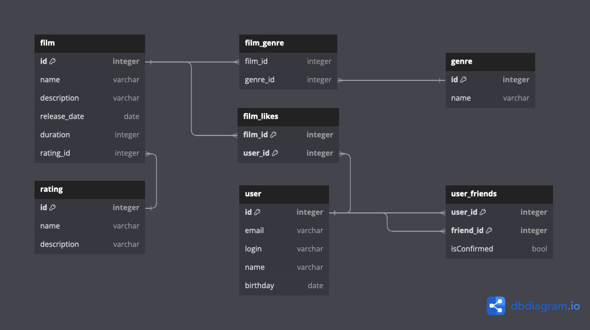

# java-filmorate
Template repository for Filmorate project.

## Схема базы данных filmorate


## SQL запросы

>#### получение всех фильмов
```sql
SELECT name
FROM film;
```
---
>#### все фильмы с рейтингом
```sql
SELECT f."name" AS film,
       fr.name AS mpa
FROM public.film f
         JOIN public.film_rating fr ON f.id = fr.id;
```
---
>#### все жанры выбранного фильма
```sql
SELECT f."name",
       g.name
FROM public.genre g
JOIN public.film_category fc ON g.id = fc.genre_id
JOIN public.film f ON f.id = fc.film_id
WHERE f.id = 5;
```
---
>#### пользователи, которые поставили лайк Фильму
```sql
SELECT u."name"
FROM public."user" u
JOIN public.film_likes fl ON u.id = fl.user_id
JOIN public.film f ON f.id = fl.film_id
WHERE f.id = 4;

SELECT u."name"
FROM public."user" u
JOIN public.film_likes fl ON u.id = fl.user_id
WHERE fl.film_id IN
    (SELECT id
     FROM public.film f
     WHERE f.name = 'The Shawshank Redemption');
```
---
>#### топ N наиболее популярных фильмов
```sql
SELECT f.name film_name,
count(f.id) likes
FROM film f
JOIN film_likes fl ON f.id = fl.film_id
GROUP BY film_name
ORDER BY likes DESC
LIMIT 5;
```
---
>#### все пользователи
```sql
SELECT *
FROM public.user;
```
---
>#### список друзей пользователя по id
```sql
SELECT name
FROM public.user
WHERE id IN
    (SELECT uf.friend_id
     FROM public.user u
     LEFT JOIN public.user_friends uf ON u.id = uf.user_id
     WHERE u.id = 1);
```
---
>#### список общих друзей двух пользователей
```sql
--через union
SELECT name
FROM
  (SELECT uf.friend_id
   FROM public.user u
   LEFT JOIN public.user_friends uf ON u.id = uf.user_id
   WHERE u.id = 1
   UNION ALL 
SELECT uf.friend_id
   FROM public.user u
   LEFT JOIN public.user_friends uf ON u.id = uf.user_id
   WHERE u.id = 3) t
INNER JOIN public.user u ON u.id = t.friend_id
GROUP BY t.friend_id,
         u.id
HAVING count(friend_id) >1;

--через cte
WITH cte AS
         (SELECT uf.friend_id
          FROM public.user u
                   LEFT JOIN public.user_friends uf ON u.id = uf.user_id
          WHERE u.id = 1)
SELECT uf.friend_id, u1.name
FROM public.user u
         LEFT JOIN public.user_friends uf ON u.id = uf.user_id
         INNER JOIN cte ON uf.friend_id = cte.friend_id
         INNER JOIN public.user u1 ON u1.id = uf.friend_id
WHERE u.id = 3;

-- join
select uf1.user_id, uf2.friend_id, u."name"
from public."user" u
         join public.user_friends uf1 on u.id = uf1.user_id
         join public.user_friends uf2 on u.id = uf2.friend_id
where u.id not in (1,3)
group by uf1.user_id, uf2.friend_id, u."name"
having count(uf2.friend_id) > 1
```
---


